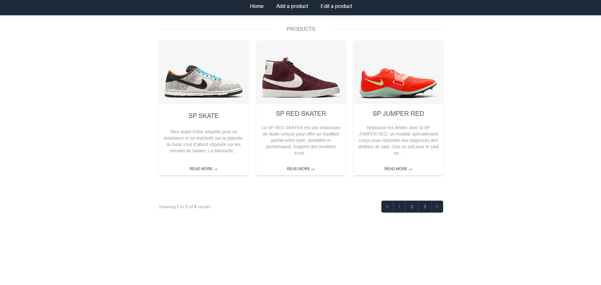
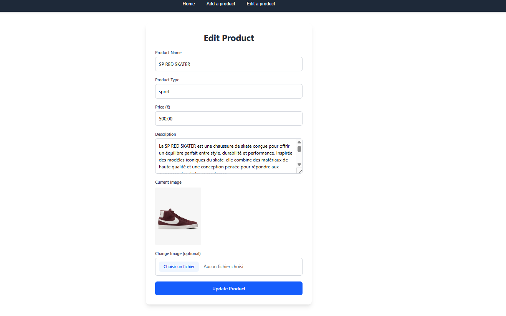

# 🛠️ Laravel Product CRUD 

## 📋 Description

This Laravel 12 application allows you to:

- ## ➕ Create
  Products (name, type, price, description, image)

- ## 📄 Display
  Products with pagination (3 per page)

- ## ✏️ Edit and 🗑️ Delete
  Existing products (including image removal)

- ## ⚠️ Handle Validation
  Errors and display success messages on both **back-end** and **front-end**

- ## 💻 Responsive Interface
  Built with **Tailwind CSS**

---

## 📸 Project Screenshots

### 🏠 Home Page

### ➕ Create Product

### ✏️ Edit Product

### 📃 Product Edit List

---

## ⚙️ Technologies Used

- PHP **8.2**
- Laravel **12**
- Tailwind CSS
- Blade Templates (Laravel)
- MySQL
- Visual Studio Code

---

## ⏱️ Time Invested

Approximately **10 hours**, divided among:

- ### 🧱 Coding and CRUD implementation
- ### 🔍 Researching Laravel/Tailwind documentation and online resources
- ### 🎥 Watching tutorial videos on Tailwind CSS
- ### 📚 Training on **Eloquent ORM** (previously used mostly raw SQL in Laravel projects)
- ### 🐞 Debugging
- ### 🧠 Designing a clear, simple, and responsive UI

---

## 🚧 Challenges Faced

- ### 🖼️ Image Handling
  Managed image uploads with `Storage::disk('public')` and deletion of old images

- ### 📱 Responsive Layouts
  Created using **Tailwind CSS** (grids, flexbox, alignment)

- ### 🛠️ Product Editing Logic
  Implemented custom `editList` method in the controller, combined logic within `edit()` and `update()` methods

---

## 📚 Skills and Knowledge Gained

- ### ✅ CRUD Workflow
  Enhanced understanding of complete **CRUD** processes with Laravel

- ### ✅ Eloquent ORM
  Improved proficiency with methods (`findOrFail`, `paginate`, `create`, `delete`)

- ### ✅ Tailwind CSS
  Grasped responsive design concepts and typography *(e.g., added Montserrat font on homepage)*

- ### ✅ RESTful Routing
  Efficiently utilized `Route::resource` for automatic RESTful routes generation

---